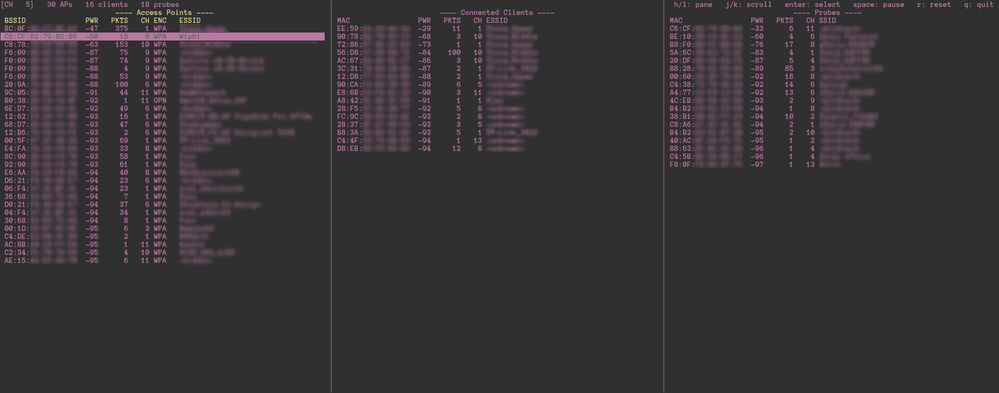
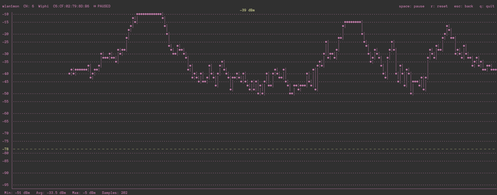

# airohunt-ng

> [!CAUTION]
> Full disclosure, this software was almost entirely written by Claude.ai, Sonnet 4.6. 

`airohunt-ng` is developed to allow you to scan for and track wireless 802.11 devices in real time. 

Whether you want to fox hunt the location of a specific device with a Yagi, or test the efficacy of antenna placement, or types of antenna this software should hopefully be useful to you. 

The scanner window shows three panes, one for access points (routers), one for clients connected to access points, and one for probes being sent out by unassociated clients. Do note that probe requests are infrequently sent so the output will not be smooth.  

The project was also my first experiment with using AI to develop software, it has been an interesting experience, and given me a lot of insight into what it is capable of. Consider the source code of this project not my work, I can only take credit (or blame) for designing the interface and packaging it up. 




## Installation

### Arch Linux (AUR)
```bash
yay -S airohunt-ng
```

### pip 

```bash
pip install airohunt-ng
```

### From source

```bash
git clone https://github.com/bag-man/airohunt-ng
cd airohunt-ng
pip install .
```

## Usage

First put your wireless interface into monitor mode:

```bash
sudo ip link set wlan0 down
sudo iw dev wlan0 set type monitor
sudo ip link set wlan0 up
```

Then run the script, defaulting to 2.4Ghz:

```
sudo airohunt-ng wlan0
```

Options: 

```
This script must be run as root.

usage: airohunt-ng [-h] [--band {2.4,5,both}] [-c CH] [--bssid MAC] [-A] [-C]
                   [-P]
                   interface

WiFi signal strength monitor

positional arguments:
  interface            Monitor-mode interface (e.g. wlan0)

options:
  -h, --help           show this help message and exit
  --band {2.4,5,both}  Band to scan: 2.4 GHz (default), 5 GHz, or both
  -c, --channel CH     Lock to a single channel instead of hopping
  --bssid MAC          Go straight to the signal graph for this BSSID
                       (requires -c)
  -A                   Show Access Points pane
  -C                   Show Connected Clients pane
  -P                   Show Probes pane

Examples:
  sudo airohunt-ng wlan0
  sudo airohunt-ng wlan0 --band 5 -AC
  sudo airohunt-ng wlan0 -c 6 --bssid BC:0F:9A:17:9E:EC
        
```

#### Deployment notes for the author
```
Update version in __init__.py
Update version in pyproject.toml 

git commit -m "Release v1.0.x"
git tag -a v1.0.1 -m "Release v1.0.x"
git push && git push origin v1.0.x

curl -sL https://github.com/bag-man/airohunt-ng/archive/v1.0.x.tar.gz | sha256sum
Update pkgver and sha256sum in PKGBUILD, regenerate .SRCINFO with `makepkg --printsrcinfo > .SRCINFO`

python -m build
twine upload dist/*
```
